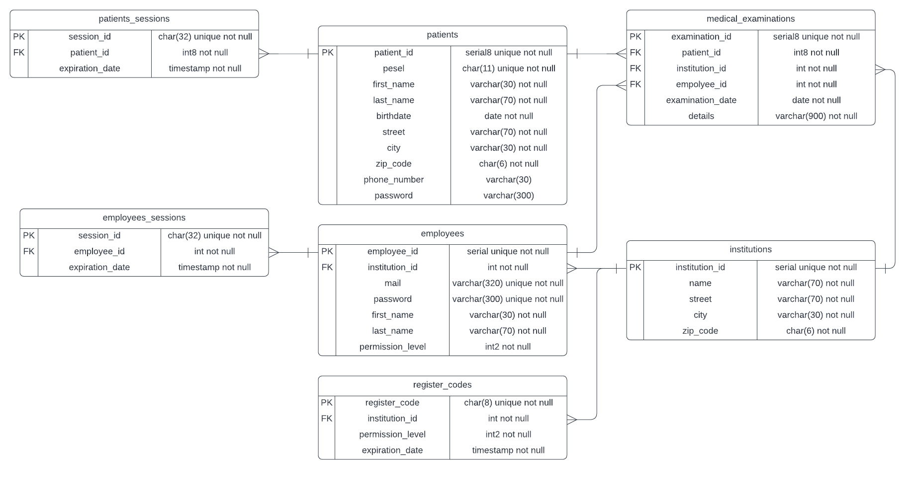

# Medical Clinic Company Manager

This project is a Java Spring Boot application with PostgreSQL database, deployed using Docker.

## Prerequisites
Make sure you have installed [Docker](https://docs.docker.com/compose/install/)

## Getting Started

1. Clone this repository to your local machine:

    ```bash
    git clone https://github.com/Pczrk/SpringBootMedicalCompanyManager.git
    ```

2. Navigate to the project directory:

    ```bash
    cd MedicalClinicCompanyManager
    ```

3. Start the application using Docker Compose:

    ```bash
    docker-compose up --build
    ```
4. Once the containers are up and running, you can access the backend application at:

    ```
    http://localhost:8080
    ```
## About project

### ERD
Initially in the database there is code for creation of a permission level 2 employee = "superUSR" and 3 institutes with ids 1, 2 and 3.

### Use-cases:
Site user:
* register patient account (if patient data is in database and register code is valid by phone number and password)
* login to patient panel (by PESEL and password)
* login to employee panel (by mail and password)
* check medical examination (by id and date of birth)

Logged in patient:
* show account data
* show list of his medical examinations
* logout

Employee permission level 1:
* add patients data to database
* edit patients data (without phone number and password)
* show list of patients medical examinations (by id)
* show patients data (by id)
* add medical examination to database (from his institution)
* remove medical examination (from his institution)
* generate register code for patients
* logout

Employee permission level 2:
* all of permission level 1 employee use-cases
* add medical examination to database (from any institution)
* delete patients from database (by id)
* add medical examination (from any institution)
* remove medical examination (from any institution)
* show medical examination (directly by id from any institution)
* generate register code for patients and employee level 1

Employee permission level 3:
* all of permission level 1 and 2 employee use-cases
* change permission level of employees (lesser than his permission level)
* generate register code for patients and employees level 1 and 2

## Endpoints:
* ### PATCH localhost:8080/api/employee/{id}/edit-permission-level
id - id of an employee\
permission-level - mandatory param
###### Example request:
PATCH localhost:8080/api/employee/4/edit-permission-level?permission-level=2\
###### Body:
Empty


* ### GET http://localhost:8080/api/employee/{id} 
id - id of an employee\
###### Example request:
GET http://localhost:8080/api/employee/4
###### Body:
Empty

* ### DELETE http://localhost:8080/api/employee/examination/{id}
id - id of an examination
###### Example request:
DELETE http://localhost:8080/api/employee/examination/1
###### Body:
Empty

* ### GET http://localhost:8080/api/employee/examination/{id}
id - id of an examination
###### Example request:
GET http://localhost:8080/api/employee/examination/1
###### Body:
Empty

* ### GET http://localhost:8080/api/employee/institution/{id}/examinations
id - id of an institution
###### Example request:
GET http://localhost:8080/api/employee/institution/1/examinations
###### Body:
Empty


* ### GET http://localhost:8080/api/employee/patient/{id}/examinations
id - id of a patient
###### Example request:
GET http://localhost:8080/api/employee/patient/1/examinations
###### Body:
Empty

* ### POST http://localhost:8080/api/employee/add-examination
###### Example request:
POST http://localhost:8080/api/employee/add-examination
###### Body:
```json
{
"medicalExaminationCreation":{
  "pesel":"85041669139",
  "examinationDate":"2021-02-02",
  "details":"some details"
}   
}
```

* ### DELETE http://localhost:8080/api/employee/patient/{id}
id - id of a patient
###### Example request:
DELETE http://localhost:8080/api/employee/patient/2
###### Body:
Empty


* ### PUT http://localhost:8080/api/employee/patient/{id}/edit
id - id of a patient
###### Example request:
PUT http://localhost:8080/api/employee/patient/2/edit
###### Body:
```json
{
"patient":{
  "pesel":"69072368641",
  "firstName":"ExampleName2",
  "lastName":"ExampleLastName2",
  "birthdate":"2000-01-01",
  "street":"Klonowa 15",
  "city":"Kielce",
  "zipCode":"25-111"
  }   
}
```


* ### POST localhost:8080/api/employee/add-patient
###### Example request:
POST localhost:8080/api/employee/add-patient
###### Body:
```json
{
"patient":{
  "pesel":"69072368641",
  "firstName":"ExampleName",
  "lastName":"ExampleLastName",
  "birthdate":"2000-01-01",
  "street":"Klonowa",
  "city":"Kielce",
  "zipCode":"25-111"
}   
}
```

* ### GET localhost:8080/api/employee/patient/{id}
id - id of a patient
###### Example request:
GET localhost:8080/api/employee/patient/1
###### Body:
Empty


* ### GET localhost:8080/api/employee/generate-register-code
permission-level - mandatory param\
institution-id - mandatory param
###### Example request:
GET localhost:8080/api/employee/generate-register-code?permission-level=1&institution-id=1
###### Body:
Empty

* ### POST localhost:8080/api/employee/login
###### Example request:
POST localhost:8080/api/employee/login
###### Body:
```json
{
"employeeLogin":{
  "mail":"example@mail.com",
  "password":"#Ex@mple123"
  }
}
```


* ### POST localhost:8080/api/employee/register
###### Example request:
POST localhost:8080/api/employee/register
###### Body:
```json
{
"employeeRegister":{
  "mail":"example@mail.com",
  "password":"#Ex@mple123",
  "passwordAgain":"#Ex@mple123",
  "firstName":"Super",
  "lastName":"User",
  "registerCode":"superUSR"
  }   
}
```


* ### DELETE localhost:8080/api/employee/logout
###### Example request:
DELETE localhost:8080/api/employee/logout
###### Body:
Empty

* ### GET http://localhost:8080/api/medical-examination
medical-examination-id - mandatory param \
date-of-birth - mandatory param
###### Example request:
GET http://localhost:8080/api/medical-examination?medical-examination-id=5&date-of-birth=2024-02-02
###### Body:
Empty

* ### POST http://localhost:8080/api/patient/register
###### Example request:
POST http://localhost:8080/api/patient/register
###### Body:
```json
{
"patientRegister":{
  "pesel":"85041669139",
  "phoneNumber":"2021-02-02",
  "registerCode":"0cX_TLdt",
  "password":"#xppPPX123",
  "passwordAgain":"#xppPPX123"
}   
}
```

* ### POST http://localhost:8080/api/patient/login
###### Example request:
POST http://localhost:8080/api/patient/login
###### Body:
```json
{
"patientLogin":{
  "pesel":"85041669139",
  "password":"#xppPPX123"
  }   
}
```

* ### DELETE http://localhost:8080/api/patient/logout
###### Example request:
DELETE http://localhost:8080/api/patient/logout
###### Body:
Empty

* ### GET http://localhost:8080/api/patient/my-medical-examinations
###### Example request:
GET http://localhost:8080/api/patient/my-medical-examinations
###### Body:
Empty

* ### GET http://localhost:8080/api/patient/account
###### Example request:
GET http://localhost:8080/api/patient/account
###### Body:
Empty